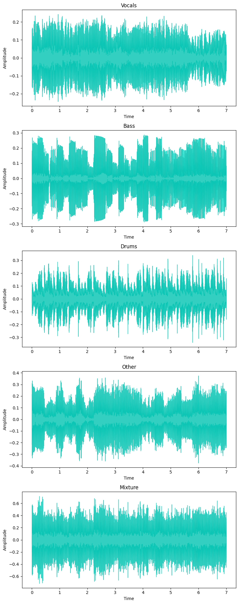
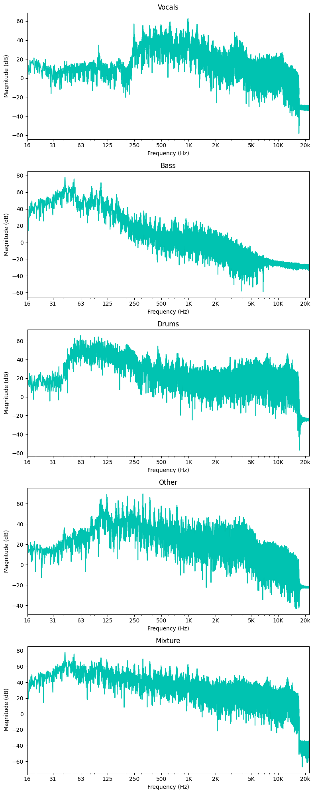
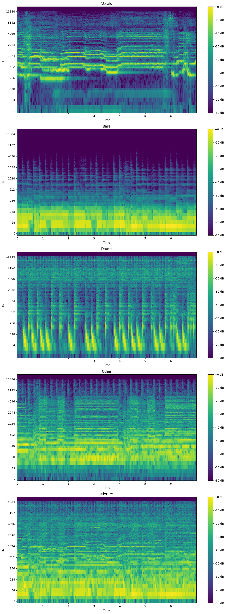

<div align="center">
    
</div>

<h1 style="text-align:center">
    Music "Demixing" with Band Split Recurrent Neural Network
</h1>

The repository has been modified from [Amantur](https://github.com/amanteur/BandSplitRNN-Pytorch) and is an unofficial PyTorch implementation of the paper [Music Source Separation with Band-split RNN](https://arxiv.org/pdf/2209.15174.pdf). Huge thank you to both for promoting this work!

---
## Table of Contents

1. [Problem Statement](#problem-statement)
2. [Background](#background)
3. [Architecture](#architecture)
4. [Datasets](#datasets)
5. [Exploratory Data Analysis (EDA)](#eda)
6. [Dependencies](#dependencies)
7. [Inference](#inference)
8. [Train your model](#trainmodel)
   1. [Dataset preprocessing](#preprocessing)
   2. [Training](#train)
   3. [Evaluation](#eval)
9. [Repository structure](#structure)
10. [Citing](#cite)

---

<a name="problem-statement"/>

## Problem Statement
Audio source separation has been a topic of interest for quite some time, but has gained increasing attention recently due an increase in computing power and the capabilities of neural networks. Source separation can be implemented to improve speech clarity in particularly noisy environment or, in our case, separate individual instruments from a song. There are many use cases for this technology, like music remixing, music information retrieval, and music education. This work seeks to review and improve upon current methods of audio source separation.

---

<a name="background"/>

## Background
When listening to music, humans inately can pick out the instruments within the complex mix of sounds. For example, it is trivial to pick out the drum set, guitar, bass, and of course the vocalist. However, there is no way to retrieve these isolated instruments that our mind "separates" or picks out from the music. It would follow that if our brains can process music in this manner, it is possible to develop algorithms that can do the same.

Methods of music source separation have been around in various forms for quite some time, but only recently has the ability to separate audio in high fidelity begun to be possible. This is due to the significant increase in computing capability over the recent years that has made training complex neural networks feasible. These "deep neural networks" (DNNs) can be trained on audio data by providing the fully "mixed" song as well as the isolated instrument "stem" to act as the target. The network then can learn how to pick out the frequencies and patterns that correlate to the individual instrument.

Since 2018, there have been many improvements on methods of source separation using neural networks. While many metrics can describe the performance of a model, it has become standard to use Signal-to-Distortion ratio (SDR) as the primary model performance metric. Below is a chart that demonstrates the improvement of various methods since 2018. Models were measured on how they performed on the [MUSDB18 dataset](https://paperswithcode.com/dataset/musdb18).

<div style="text-align:center;">
  
</div>
<p style="text-align:center">
  <em>Figure: Audio Source Separation Methods (<a href="https://paperswithcode.com/sota/music-source-separation-on-musdb18">source: paperswithcode.com</a>)</em>
</p>

|Rank|Model|SDR (avg)|SDR (vocals)|SDR (drums)|SDR (bass)|SDR (other)|Extra Training Data|Paper|Year|
|---|---|---|---|---|---|---|---|---|---|
| 1 | Sparse HT Demucs (fine tuned) | 9.2 | 9.37 | 10.83 | 10.47 | 6.41 | Y | Hybrid Transformers for Music Source Separation | 2022 |
| 2 | Hybrid Transformer Demucs (find tuned) | 9 | 9.2 | 10.08 | 9.78 | 6.42 | Y | Hybrid Transformers for Music Source Separation | 2022 |
| 3 | Band-Split RNN (semi-sup.) | 8.97 | 10.47 | 10.15 | 8.16 | 7.08 | Y | Music Source Separation with Band-split RNN | 2022 |
| 4 | Band-Split RNN | 8.24 | 10.01 | 9.01 | 7.22 | 6.7 | N | Music Source Separation with Band-split RNN | 2022 |
| 5 | Hybrid Demucs | 7.68 | 8.13 | 8.24 | 8.76 | 5.59 | N | Hybrid Spectrogram and Waveform Source Separation | 2021 |
| 6 | KUIELab-MDX-Net | 7.54 | 9 | 7.33 | 7.86 | 5.95 | N | KUIELab-MDX-Net: A Two-Stream Neural Network for Music Demixing | 2021 |
| 7 | CDE-HTCN | 6.89 | 7.37 | 7.33 | 7.92 | 4.92 | N | Hierarchic Temporal Convolutional Network With Cross-Domain Encoder for Music Source Separation | 2022 |
| 8 | Attentive-MultiResUNet | 6.81 | 8.57 | 7.63 | 5.88 | 5.14 | N | An Efficient Short-Time Discrete Cosine Transform and Attentive MultiResUNet Framework for Music Source Separation | 2022 |
| 9 | DEMUCS (extra) | 6.79 | 7.29 | 7.58 | 7.6 | 4.69 | Y | Music Source Separation in the Waveform Domain | 2019 |
| 10 | CWS-PResUNet | 6.77 | 8.92 | 6.38 | 5.93 | 5.84 | N | CWS-PResUNet: Music Source Separation with Channel-wise Subband Phase-aware ResUNet | 2021 |
| 11 | D3Net | 6.68 | 7.8 | 7.36 | 6.2 | 5.37 | Y | D3Net: Densely connected multidilated DenseNet for music source separation | 2020 |
| 12 | Conv-TasNet (extra) | 6.32 | 6.74 | 7.11 | 7 | | Y | Conv-TasNet: Surpassing Ideal Time-Frequency Magnitude Masking for Speech Separation | 2018 |
| 13 | UMXL | 6.316 | 7.213 | 7.148 | 6.015 | 4.889 | Y | Open-Unmix - A Reference Implementation for Music Source Separation | 2021 |
| 14 | DEMUCS | 6.28 | 6.84 | 6.86 | 7.01 | 4.42 | N | Music Source Separation in the Waveform Domain | 2019 |
| 15 | TAK2 | 6.04 | 7.16 | 6.81 | 5.4 | 4.8 | Y | MMDenseLSTM: An efficient combination of convolutional and recurrent neural networks for audio source separation | 2018 |
| 16 | D3Net | 6.01 | 7.24 | 7.01 | 5.25 | 4.53 | N | D3Net: Densely connected multidilated DenseNet for music source separation | 2021 |
| 17 | Spleeter (MWF) | 5.91 | 6.86 | 6.71 | 5.51 | 4.02 | Y | Spleeter: A Fast And State-of-the Art Music Source Separation Tool With Pre-trained Models | 2019 |
| 18 | LaSAFT+GPoCM | 5.88 | 7.33 | 5.68 | 5.63 | 4.87 | N | LaSAFT: Latent Source Attentive Frequency Transformation for Conditioned Source Separation | 2020 |
| 19 | X-UMX | 5.79 | 6.61 | 6.47 | 5.43 | 4.64 | N | All for One and One for All: Improving Music Separation by Bridging Networks | 2020 |
| 20 | Conv-TasNet | 5.73 | 6.81 | 6.08 | 5.66 | 4.37 | N | Conv-TasNet: Surpassing Ideal Time-Frequency Magnitude Masking for Speech Separation | 2018 |
| 21 | Sams-Net | 5.65 | 6.61 | 6.63 | 5.25 | 4.09 | N | Sams-Net: A Sliced Attention-based Neural Network for Music Source Separation | 2019 |
| 22 | Meta-TasNet | 5.52 | 6.4 | 5.91 | 5.58 | 4.19 | N | Meta-learning Extractors for Music Source Separation | 2020 |
| 23 | UMX | 5.33 | 6.32 | 5.73 | 5.23 | 4.02 | N | Open-Unmix - A Reference Implementation for Music Source Separation | 2019 |
| 24 | Wavenet | 3.5 | 3.46 | 4.6 | 2.49 | 0.54 | N | End-to-end music source separation: is it possible in the waveform domain? | 2018 |
| 25 | STL2 | 3.23 | 3.25 | 4.22 | 3.21 | 2.25 | N | Wave-U-Net: A Multi-Scale Neural Network for End-to-End Audio Source Separation | 2018 |

---

<a name="architecture"/>

## Architecture


---

<a name="datasets"/>

## Datasets
The raw audio dataset is provided from [MUSDB18](https://paperswithcode.com/dataset/musdb18) and are organized into "vocals", "drums", "bass", and "other" stem files and "mixture" fully mixed track.

---
<a name="eda"/>

## Exploratory Data Analysis (EDA)

### Waveform
- The waveform of the data shows the oscillations of pressure amplitude over time. This is effectively a "raw" format of audio data.
- It is defined by the sampling frequency and bit depth.
    - The sampling frequency refers to how many samples of audio are played back per second (i.e. 44.1kHz means that every second, 44,100 samples are played). This determines the upper bound of frequencies that can be represented by the audio signal.
    - The bit depth refers to how precise the amplitude values are determining the dynamic range of an audio signal (i.e. 16-bit depth can represent 65,536 unique numbers, resulting in approx. 96dB of dynamic range)
- To simplify, the sampling rate essentially controls the resolution of the x-axis and the bit depth controls the resolution of the y-axis
- While it can often be hard to glean information by visually inspecting waveforms, you can see different characteristics in each different instrument's waveform.
    - Vocals - Notice how the vocals have a more consistently full signal (likely holding notes until the dropoff in the last second).
    - Bass - Notice how the bass appears to almost have "blocks" of waves at similar amplitudes (likely holding a singl note).
    - Drums - Notice how the drums have many spikes in amplitude (potentially snare or bass drum hits).
    - Other - Less can be gleaned from other, as it likely contains a mixture of other instruments. However, there does seem to be some amplitude fluctations that somewhat consistent to the bas signal.
    - Mixture - Notice how the mixture is the fullest signal with the highest amplitude. Because all signals have been summed together, it is incredibly challenging to glean anything from this signal from visual inspection.
- For further analysis, the signals need to be brought into the frequency domain.

<div style="text-align:center;">
  
</div>

### Frequency Spectrum
- The spectrum of a waveform shows the magnitude (in dB) of the signal per frequency.
- Notice there is no time component here, rather the magnitude (dB) is with reference to frequencies of the entire audio signal (in this case 30 sec clip)
- While the plot below shows the spectrum for the entire signal, we will be using this concept to take the spectrum of small pieces of the signal to reintroduce a time component when we create spectrograms next.

<div style="text-align:center;">
  
</div>

### Spectrogram
- A spectrogram is the combination of a waveform and spectrum plot, resulting in frequency magnitude (in dB) over time.
- It has been scaled so that 0 dB is the maximum value.
- Notice how patterns emerge in the light-green and yellow, looking like diagonal lines that move up and down. These patterns correspond to specific attributes of the music, such as melodies.

<div style="text-align:center;">
  
</div>

---

<a name="dependencies"/>

## Dependencies

Python version - **3.10**.  
To install dependencies, run:
```
pip install -r requirements.txt
```
Additionally, **ffmpeg** should be installed in the venv.  
If using ``conda`[example_vocals.mp3](..%2F..%2F..%2FDownloads%2Fexample_vocals.mp3)`, you can run:
```
conda install -c conda-forge ffmpeg
```
All scripts should be run from `src` directory.

`Train`/`evaluation`/`inference` pipelines support GPU acceleration. 
To activate it, specify the following `env` variable:
```
export CUDA_VISIBLE_DEVICES={DEVICE_NUM} 
```

---
<a name="inference"/>

## Inference

To run inference on your file(s), firstly, you need to download checkpoints.

Available checkpoints:

| Target | Epoch | uSDR | cSDR |
|---|---|---|---|
| Vocals | - | - | - |
| Bass | - | - | - |
| Drums | - | - | - |
| Other | - | - | - |

After you download the `.pt` file, put it into `./saved_models/{TARGET}/` directory.

Afterwards, run the following script: 

```
python3 inference.py [-h] -i IN_PATH -o OUT_PATH [-t TARGET] [-c CKPT_PATH] [-d DEVICE]

options:
  -h, --help            show this help message and exit
  -i IN_PATH, --in-path IN_PATH
                        Path to the input directory/file with .wav/.mp3 extensions.
  -o OUT_PATH, --out-path OUT_PATH
                        Path to the output directory. Files will be saved in .wav format with sr=44100.
  -t TARGET, --target TARGET
                        Name of the target source to extract.
  -c CKPT_PATH, --ckpt-path CKPT_PATH
                        Path to model's checkpoint. If not specified, the .ckpt from SAVED_MODELS_DIR/{target} is used.
  -d DEVICE, --device DEVICE
                        Device name - either 'cuda', or 'cpu'.
```
You can customize inference via changing `audio_params` in `./saved_models/{TARGET}/hparams.yaml` file. Here is `vocals` example:
```
python3 inference.py -i ../example/example.mp3 -o ../example/ -t vocals
```

There is still some work going on with training better checkpoints, 
and at this moment I've trained only (pretty bad) vocals extraction model. 

---
<a name="trainmodel"/>

## Model Training

In this section, the model training pipeline is described.

---

<a name="preprocessing"/>

### Dataset preprocessing

The authors used the `MUSDB18-HQ` dataset to train an initial source separation model.
You can access it via [Zenodo](https://zenodo.org/record/3338373#.Y_jrMC96D5g).

After downloading, set the path to this dataset as an environmental variable 
(you'll need to specify it before running the `train` and `evaluation` pipelines):
```
export MUSDB_DIR={MUSDB_DIR}
```

To speed up the training process, instead of loading whole files, 
we can precompute the indices of fragments we need to extract. 
To select these indices, the proposed Source Activity Detection algorithm was used.

To read the `musdb18` dataset and extract salient fragments according to the `target` source, use the following script:
```
python3 prepare_dataset.py [-h] -i INPUT_DIR -o OUTPUT_DIR [--subset SUBSET] [--split SPLIT] [--sad_cfg SAD_CFG] [-t TARGET [TARGET ...]]

options:
  -h, --help            show this help message and exit
  -i INPUT_DIR, --input_dir INPUT_DIR
                        Path to directory with musdb18 dataset
  -o OUTPUT_DIR, --output_dir OUTPUT_DIR
                        Path to directory where output .txt file is saved
  --subset SUBSET       Train/test subset of the dataset to process
  --split SPLIT         Train/valid split of train dataset. Used if subset=train
  --sad_cfg SAD_CFG     Path to Source Activity Detection config file
  -t TARGET [TARGET ...], --target TARGET [TARGET ...]
                        Target source. SAD will save salient fragments of vocal audio.

```
Output is saved to `{OUTPUT_DIR}/{TARGET}_{SUBSET}.txt` file. The structure of the file is as follows:
```
{MUSDB18 TRACKNAME}\t{START_INDEX}\t{END_INDEX}\n
```

---
<a name="train"/>

### Training

To train the model, a combination of `PyTorch-Lightning` and `hydra` was used.
All configuration files are stored in the `src/conf` directory in `hydra`-friendly format.

To start training a model with given configurations, just use the following script:
```
python train.py
```
To configure the training process, follow `hydra` [instructions](https://hydra.cc/docs/advanced/override_grammar/basic/).
By default, the model is trained to extract `vocals`. To train a model to extract other sources, use the following scripts:
```
python train.py train_dataset.target=bass model=bandsplitrnnbass
python train.py train_dataset.target=drums model=bandsplitrnndrums
python train.py train_dataset.target=other
```

To load the model from a checkpoint, in the script include:
```
ckpt_path=path/to/checkpoint.ckpt
```

After training is started, the logging folder will be created for a particular experiment with the following path:
```
src/logs/bandsplitrnn/${now:%Y-%m-%d}_${now:%H-%M}/
```
This folder will have the following structure:
```
├── tb_logs
│   └── tensorboard_log_file    - main tensorboard log file 
├── weights
│   └── *.ckpt                  - lightning model checkpoint files.
└── hydra
│   └──config.yaml              - hydra configuration and override files 
└── train.log                   - logging file for train.py
   
```

---
<a name="eval"/>

### Evaluation

To start evaluating a model with given configurations, use the following script:

```
python3 evaluate.py [-h] -d RUN_DIR [--device DEVICE]

options:
  -h, --help            show this help message and exit
  -d RUN_DIR, --run-dir RUN_DIR
                        Path to directory checkpoints, configs, etc
  --device DEVICE       Device name - either 'cuda', or 'cpu'.
```

This script creates `test.log` in the `RUN_DIR` directory and writes the `uSDR` and `cSDR` metrics there 
for the test subset of the MUSDB18 dataset.


---
<a name="structure"/>

## Repository structure
The structure of this repository is as following:
```
├── src
│   ├── conf                        - hydra configuration files
│   │   └── **/*.yaml               
│   ├── data                        - directory with data processing modules
│   │   └── *.py
│   ├── files                       - output files from prepare_dataset.py script
│   │   └── *.txt
│   ├── model                       - directory with modules of the model 
│   │   ├── modules
│   │   │   └── *.py
│   │   ├── __init__.py
│   │   ├── bandsplitrnn.py         - file with the model itself
│   │   └── pl_model.py             - file with Pytorch-Lightning Module for training and validation pipeline
│   ├── notebooks                   - directory with notebooks for audio pre-processing
│   │   └── *.py
│   ├── utils                       - directory with utilities for evaluation and inference pipelines
│   │   └── *.py                    
│   ├── evaluate.py                 - script for evaluation pipeline 
│   ├── inference.py                - script for inference pipeline
│   ├── prepare_dataset.py          - script for dataset preprocessing pipeline
│   ├── separator.py                - separator class, which is used in evaluation and inference pipelines
│   └── train.py                    - script for training pipeline
├── example                         - test example for inference.py
│   └── *.wav
├── images
├── .gitignore
├── README.md 
└── requirement.txt
```

---
<a name="cite"/>

## Citing

To cite this paper, please use:
```
@misc{https://doi.org/10.48550/arxiv.2209.15174,
  doi = {10.48550/ARXIV.2209.15174},
  url = {https://arxiv.org/abs/2209.15174},
  author = {Luo, Yi and Yu, Jianwei},
  keywords = {Audio and Speech Processing (eess.AS), Machine Learning (cs.LG), Sound (cs.SD), Signal Processing (eess.SP), FOS: Electrical engineering, electronic engineering, information engineering, FOS: Electrical engineering, electronic engineering, information engineering, FOS: Computer and information sciences, FOS: Computer and information sciences},
  title = {Music Source Separation with Band-split RNN},
  publisher = {arXiv},
  year = {2022},
  copyright = {Creative Commons Attribution Non Commercial Share Alike 4.0 International}
}
```
